### Creat a flow
mouse right key and click **Script Node Flow->Create.**

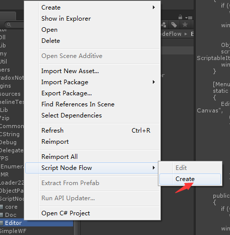

<br/>

### Edit the flow

select the asset by mouse right key and click **Script Node Flow->Edit.**
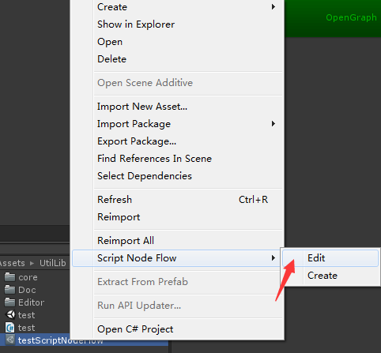

<br/>

**OR**

click the button named 'OpenGraph' in Inspector
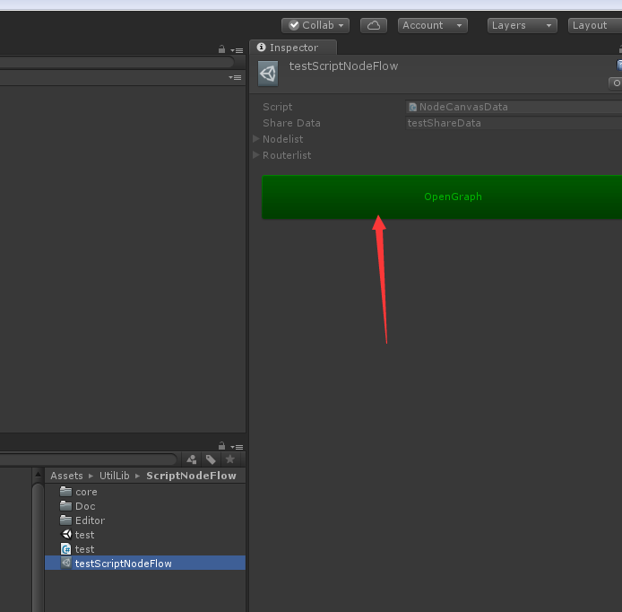

<br/>

finally,you will see a window like this

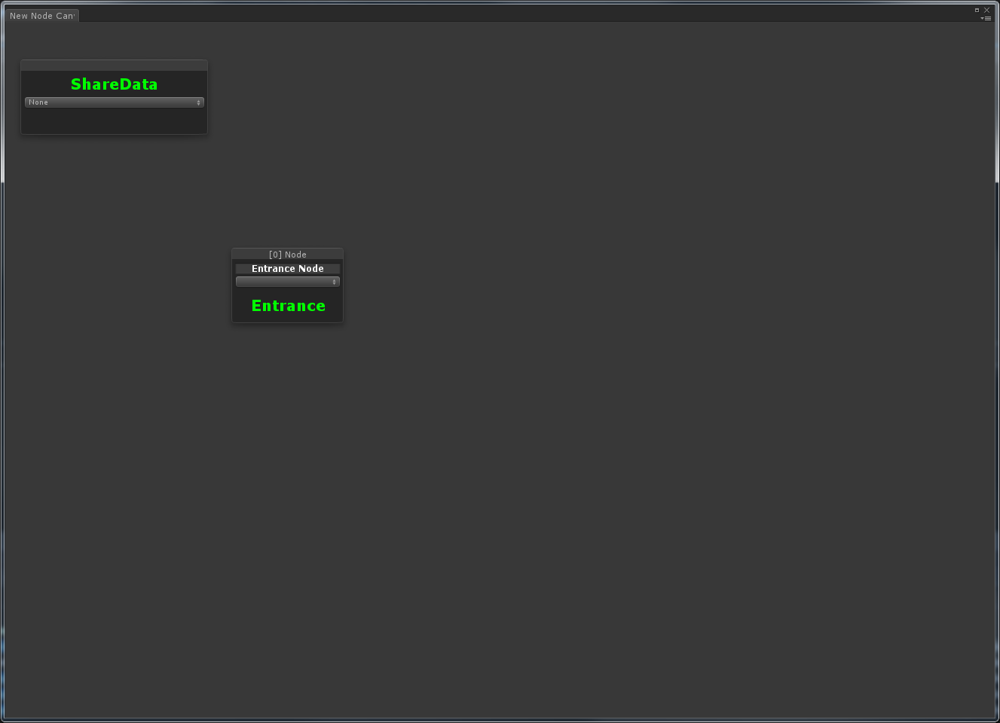

<br/>

### Node

#### *Flow's entrance*
It's the start point of the flow.

**Note:any flow must contain a entrance.**

<br/>

#### *How to change the entrance?*

mouse right key in any Node,and click 'Set Entrance'
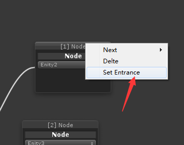

<br/>

#### *How to add a Node ?*

mouse right key in blank
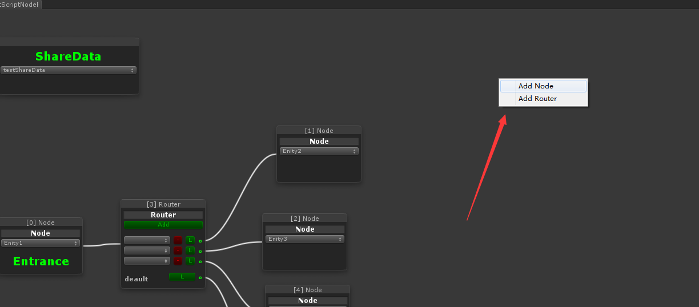

<br/>

####  *Definite your operation in the Node*

you must select a option,if not , there will is something wrong in runtime period
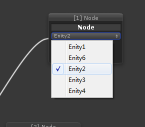

<br/>

#### *Add your operation script*

you must definite a class derived from Node. 
```
public class Enity1 : Node
{
    public Enity1(SharedData data) : base(data) { }

    protected override void execute()
    {
        Debug.Log("Enity1");

        //get share data and you can modify it
        (shareData as testShareData).state = 3;

        //call finish method when you're sure finished completely
        finish();
    }
}
```

<br/>

#### *Select the next one*

mouse right key in any Node,then you can select a existing Node or create a new one.
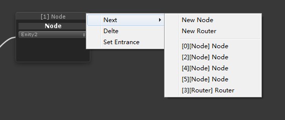

<br/>

### Router


you can click Add button to add a condition to conditions array;

#### *How to add a Router ?*
mouse right key in blank


<br/>

#### *Add your condition script*

you must definite a class derived from RouterCondition. 
```
public class Condition1 : RouterCondition
{
    public Condition1(SharedData data) : base(data) { }

    public override bool justify()
    {
        Debug.Log("Condition1");

        //get shared data
        testShareData data = shareData as testShareData;


        return data.state == 1;
    }
}
```

<br/>

#### *Select the next one*

you can click the L button of any condition,and you have to select a option,select a existing Node or a new Node.

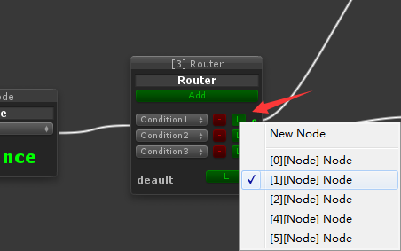

**Note**
+ finally the flow will execute the default's next Node if every condition do not justify.
+ every condition must set the next Node and the default must set the next Node.

<br/>

### sharedData

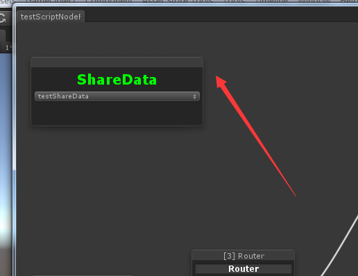

**shareData will cross throught the flow's period. if you don't need it , just keep it is None.**

<br/>

#### *Add your sharedData script*

you must definite a class derived from SharedData. 
```
public class testShareData: SharedData
{
    public int state = 0;
}
```

<br/>

#### *get your sharedData in current Node*

```
public class Enity1 : Node
{
    public Enity1(SharedData data) : base(data) { }

    protected override void execute()
    {
        Debug.Log("Enity1");

        //get share data and you can modify it
        (shareData as testShareData).state = 3;

        //call finish method when you're sure finished completely
        finish();
    }
}

public class Condition1 : RouterCondition
{
    public Condition1(SharedData data) : base(data) { }

    public override bool justify()
    {
        Debug.Log("Condition1");

        //get shared data
        testShareData data = shareData as testShareData;


        return data.state == 1;
    }
}

```
<br/>

### How to use it in my project ?

I create single prefab per flow.
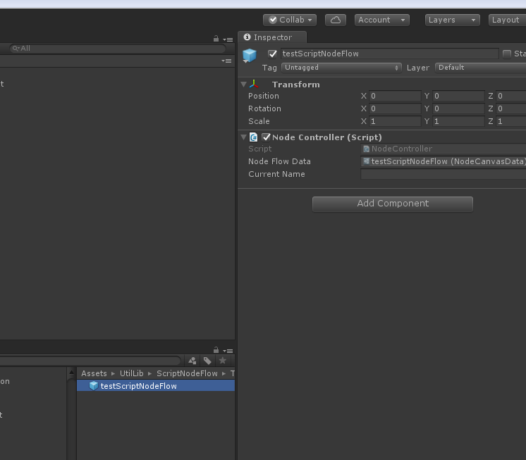

you need start a flow, instantiate it,
and you want it stopping , destroy it.

####  *listen the finish event*

```
NodeController.onFinish
```

<br/>

#### *runtime state*

runtime mode, you can click the button named 'Graph' to open the graph.
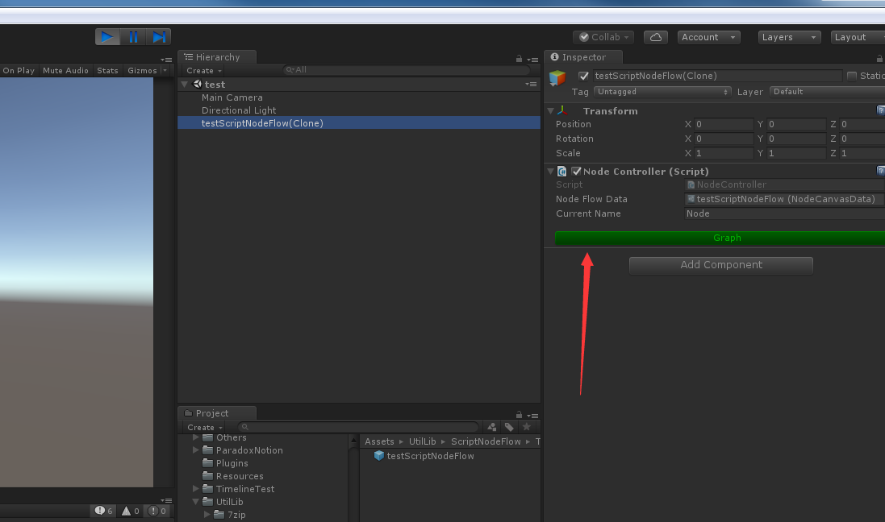

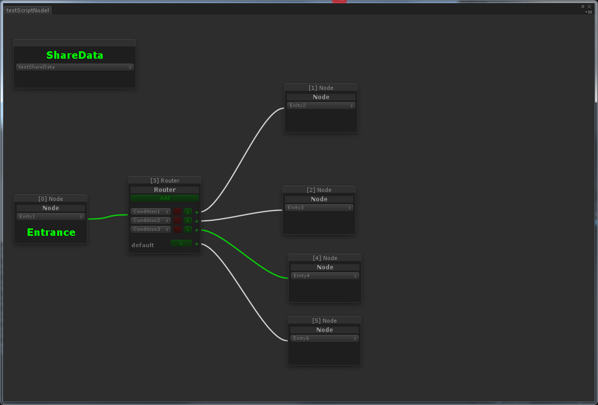
<br/>


### Other

+ you can creat a circle flow,but I don't advocate that ,cause it never stop .

<br/>

### Contact me

frank.wangqi@foxmail.com